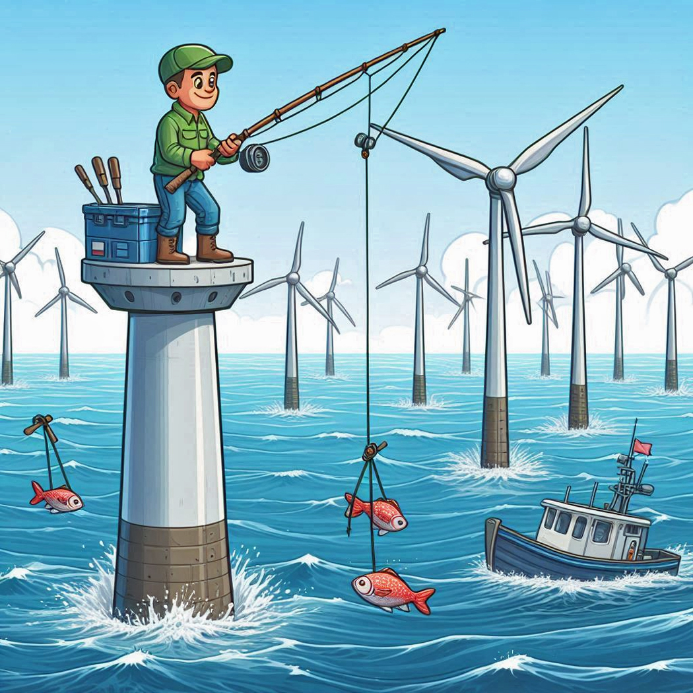

# Wind Turbine Project

Welcome to the project repo for the Wind Turbine Project. The Wind Turbine project is being done to meet the requirements of GEOG 463/563 at Oregon State University during the spring term of 2025. This repository will contain all the code and data we gather to build and implement the data analysis system supporting the project, notes our weekly 1:1s, and copies of the paper we write to report on our results. To learn more about the course, visit the [Analytic Workflows Repo](https://github.com/Analytical-Workflows-for-Earth-Science/Sp2025).

## Project Description

Oregon is considering installing floating wind turbine farms off the Oregon coast as part of its electrical grid. The decision is complicated by the fact that there are costs to deploying wind turbines that offset the benefit of the clean electricity. Beyond the direct cost of the turbine farms, there are impacts on tourism and views, on whales, on fisheries, and so on.

The benefits and costs of wind turbines depend on their location. The project aims to make benefits and costs explicit and to implement a spacial optimization system that can maximize the "profits" (benefits minus costs) of turbine farm location strategies. The initial effort in GEOG 463/563 aims to compare electricity generated and fishery output measured in dollar values and produce optimal location strategies based on these dollar values. Our implementation will try to factor out electricity benefits and fishery impacts from the optimization framework so that it will be easier to add other costs/impacts of turbine farms in subsequent analyses.

## Project Stages

In order to implement the project, the team will accomplish the following tasks:

1)  Set up the relevant infrastructure (Trello, Slack, Git & GitHub, shared file system, R & RStudio)
2)  Do a literature search to identify 10-20 papers that will teach us about the subject area. Focus on data sets that can get us up and running quickly. Save simple summaries of interesting articles in our repo.
3)  Collect, clean, wrangle, analyze, and describe the data. Use R and Excel as necessary. Create metadata describing the data set. Write a data summary document that includes visualizations.
4)  Build an R system that optimizes a sum of positive benefits and negative costs relative to the locations of wind turbine systems. Write it in such a way that it will be as easy as possible to add more cost considerations in the future.
5)  Document the process in two ways: keep weekly notes of our 1:1 meetings, and then write a 10-15 page paper explaining our results.

## Project Schedule

| **Week** | **Infrastructure** | **Bibliography** | **Data Sources** | **Optimization** | **Paper** |
|----|----|----|----|----|----|
| 1 (4/04) | Started, Learning |  |  |  |  |
| 2 (4/11) | Learning, Ready |  |  |  |  |
| 3 (4/18) |  | Search Started | Search Started |  |  |
| 4 (4/25) |  | Search finished | Wrangling |  | Draft Bibliog... |
| 5 (5/02) |  |  | Notebooks ready | Design Ready | Draft Data |
| 6 (5/09) |  | More as needed |  | In Progress | Draft Strategy |
| 7 (5/16) |  |  | More as needed | Beta Ready | Draft Code Desc. |
| 8 (5/23) |  |  |  | Debugging | Draft |
| 9 (5/30) |  |  |  | Ongoing |  |
| 10 (6/06) | BUFFER | BUFFER | BUFFER | BUFFER | BUFFER |

See our [Trello site](https://trello.com/b/Z67GFNTV/wind-turbine-project) for more details.

The implementation is in four files in the "Code" sub-directory:

-   Step 1: Setup basic data structures and build the grid we use for the rest of the analysis. The leasing strategy off the Oregon Coast allows electric companies to pay for the opportunity to set up a Wind Turbine anywhere in the target areas off Brookings and Coos Bay. Assuming that a single Turbine requires 2x2km of space to operate, we arbitrarily lay a grid of similarly sized regions over the regions.

    The Coos Bay lease area, to the upper left of the analysis area, is at 43.8°-44.3°N, 125.5°-124.8°W. The Brookings lease area, to the lower right of the analysis area, is at 42.0°-42.8°N, 124.8°-124.3°W. There are 1,586 potential locations in the two areas, assuming 2x2km spacing.

    Run Step 1 by sourcing the entire file. It contains a function that is called by the Step 2 code that loads wind data into the grid, so, you have to run Step 1 first. At the end of execution, it prints a debugging table showing the grid areas. TODO: Make this a map.

-   Step 2: Process the Wind Data, and store it into the analysis grid. The Wind Data was downloaded from NREL. It covers a rectangular area defined by the Coos Bay lease area to its northwest and by Brookings to its southeast. You can download it the entire data set from this link: [NREL 2019 dataset for the analysis area](https://1drv.ms/u/c/fa5fbd6ce30e021b/Ea8YvQTuAhFGvc27bwSJiOkBuU3j20lZ3p2xx3IAe-jukA?e=vOswCE). Unzip it into a directory, and then (if necessary) change the Step 2 code to point to that directory. There are comments in the code to help you with that.

    The ZIP file contains 51M hourly records in CSV files that, when unloaded from the ZIP file, take up 2.86G of storage. These CSV files have an idiosyncratic structure. The first row contains data that is constant over all the data rows (the subset of this data we need is also in the file name, which is where we get it – as a result, we ignore the first row while reading). The second row contains column labels. The rest of the rows contain actual data.

    Because we want a data file that we can use flexibly moving forward, we build an output file that contains the ten columns in the CSV files and three columns for SITEID, LAT, and LON, filtered down to our lease area locations. We are processing wind data from a height of 120m, and air temperature from a height of 2m.

    Because everyone other than us who is reading this README will want to run the code against a test dataset, we have built a ZIP file containing a smaller dataset called WindDataSubset.zip, which we've stored in the Data subdirectory of our project. It filters the large dataset (bounded by latitude and longitude) to the subset of data in the two lease areas, then filters to 10% of those sites using geographic stratification, and then keeps four months (January, April, July, and October) to further reduce the data without introducing seasonal problems. The results from this test dataset mirror our larger work and make it easier to look at what we're doing for the average Joe. Look to the comments in the "Step 2" script to edit the code to point to this subset.

    Run Step 2 by sourcing whichever dataset you use. The larger dataset will take a while; the smaller dataset will run quickly. Both will create a single CSV file with the same name unless you take care.

-   Step 3: Calculate power available at each grid point. Rather than choosing a particular brand of wind turbine, we use a generic power curve for a 10MW offshore turbine. We calculate annual potential revenue metrics per location. The mean capacity factor for the area is 36.5%. There are 566 high-quality sites (capacity factor \>= 40%). The total achievable annual revenue for the area is \$2.5B (assuming \$50/MWh).

    Run Step 3 by sourcing the file. It creates three "maps" (TODO: make real maps).

-   Step 4: Fisheries data

    Our fisheries strategy is evolving. The version "Step 4a" calculates a simple proxy allocation of annual Oregon commercial fishing data (around \$190M statewide, of which we estimate \$9.45M to come from the study area). The code contains two algorithms: calculate fishing in a grid zone based on its distance from shore, and calculate it based on the depth of water in the area.

    A key assumption is that fishing in a zone with a wind turbine is only 1/2 as productive as fishing in open water. This is parameter in the code, and 1/4 and 3/4 are coded up as options to explore.

    Run Step 4 by sourcing the file. It also contains several "maps" (TODO: make real maps).
